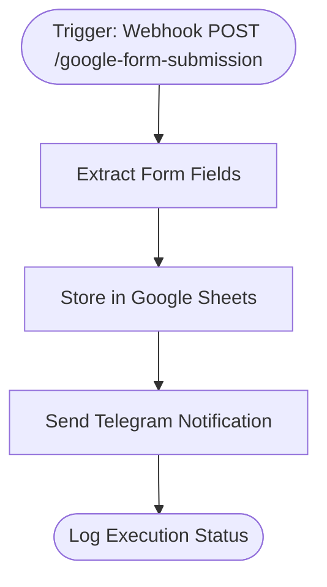

# context.md — Forms - Store and Notify - Google Sheets and Telegram

## Purpose
Automatically captures Google Form submissions, stores them in Google Sheets for record-keeping, and fires a Telegram notification to the team in real time — eliminating manual monitoring of form responses.

## What It Does
1. **Receives** a POST request from Google Apps Script when a Google Form is submitted
2. **Extracts** the form fields (name, email, message, timestamp) from the request body
3. **Appends** a new row to a designated Google Sheets spreadsheet with the response data
4. **Sends** a formatted Telegram message to a configured chat ID with the submission details
5. **Logs** the execution outcome (status, timestamp, submitter name, which steps succeeded)

## Workflow Diagram



> Diagram auto-generated from workflow node graph at submission time.  
> Each box represents an n8n node in execution order.  
> Rounded boxes mark the trigger and terminal nodes.

## Tools & Connectors Used
| Tool / Service | How It's Used |
|---|---|
| n8n Webhook | Receives POST submissions from Google Apps Script attached to the Google Form |
| Google Sheets | Appends one row per form submission to the "Form Responses" sheet |
| Telegram | Sends a formatted notification message to the configured chat ID |

## Credentials Required
| Credential Name | Service | Notes |
|---|---|---|
| Google Sheets OAuth2 | Google Sheets | Must have write access to the target spreadsheet |
| Telegram Bot | Telegram | Bot must be a member of the target chat |

> ⚠️ Never include credential values — names only.

## KPI Baseline
| Metric | Value |
|---|---|
| Manual time per response check (before) | ~5 minutes |
| Estimated form submissions per month | ~200 |
| Projected hours saved/month | ~16 hours |

## Risk Self-Assessment
| Risk Type | Present? | Notes |
|---|---|---|
| Handles PII / personal data | Yes | Collects name and email from form respondents |
| Makes external API calls | Yes | Google Sheets API, Telegram Bot API |
| Involves financial data | No | — |
| Requires human decision point | No | Fully automated end-to-end |

## Submitter
**Name:** Vishal Mishra  
**Date:** 2026-05-22  
**n8n Workflow ID:** tpHlIsVmaSBf1R5b  
**Instance:** fulcrumtest.app.n8n.cloud

---

## Post-Setup Configuration Required

Before going live, two values in the workflow must be updated:

1. **Google Sheets node** — replace `YOUR_SPREADSHEET_ID` with the actual spreadsheet ID from the URL of your target Google Sheet
2. **Telegram node** — replace `YOUR_TELEGRAM_CHAT_ID` with your chat ID (use [@get_id_bot](https://t.me/get_id_bot) to find it)

### Google Apps Script (paste into your Google Form)
In your Google Form → Tools → Script Editor, paste:

```javascript
function onFormSubmit(e) {
  var responses = e.namedValues;
  var payload = {
    name: responses['Name'] ? responses['Name'][0] : '',
    email: responses['Email'] ? responses['Email'][0] : '',
    message: responses['Message'] ? responses['Message'][0] : '',
    timestamp: new Date().toISOString()
  };
  var options = {
    method: 'post',
    contentType: 'application/json',
    payload: JSON.stringify(payload)
  };
  UrlFetchApp.fetch('https://fulcrumtest.app.n8n.cloud/webhook/google-form-submission', options);
}
```

Then add a trigger: **Form submit → onFormSubmit**.
