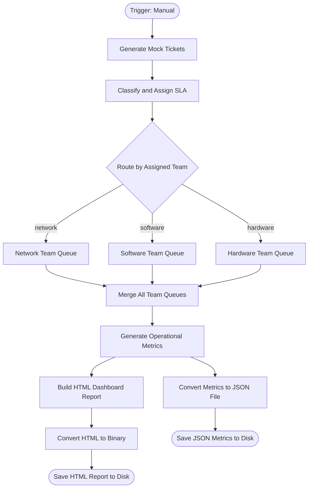

# context.md — IT - Service Desk Triage - Demo

## Purpose
Simulates a complete internal IT service desk triage pipeline for demo and training purposes. Eliminates the manual effort of triaging, classifying, and routing support tickets to the correct team.

## What It Does
1. Generates 12 randomised mock support tickets with realistic employee names, issue types, severities, and departments
2. Classifies each ticket by issue type and routes it to the correct team (Network, Software, or Hardware)
3. Assigns an SLA priority level (P1–P4) and calculates response and resolution deadlines per ticket
4. Flags any Critical-severity tickets as ESCALATED for immediate attention
5. Aggregates all tickets and computes operational metrics (open count, critical count, team distribution, average SLA targets)
6. Builds a styled HTML dashboard report and saves it alongside a JSON metrics file to disk

## Workflow Diagram

> Diagram auto-generated from workflow node graph at submission time.

## Tools & Connectors Used
| Tool / Service | How It's Used |
|---|---|
| n8n Code node | Ticket generation, SLA classification, metrics aggregation, HTML report building |
| n8n Switch node | Routes tickets to one of three team queues based on assigned_team |
| n8n Set node | Stamps queue metadata (queue, queue_label, queued_at) onto each ticket |
| n8n Merge node | Appends all three team queues back into a single stream |
| n8n Convert to File | Serialises HTML content and JSON metrics into binary files |
| n8n Read/Write Files | Writes output files to /home/node/ on the n8n server |

## Credentials Required
None — this workflow is entirely self-contained with no external API calls.

## KPI Baseline
| Metric | Value |
|---|---|
| Manual time per run (before) | 20 minutes |
| Estimated runs per week | 5 |
| Projected hours saved/week | 1.67 hours |

## Risk Self-Assessment
| Risk Type | Present? | Notes |
|---|---|---|
| Handles PII / personal data | No | All names and data are mock/synthetic |
| Makes external API calls | No | Fully self-contained |
| Involves financial data | No | |
| Requires human decision point | No | Fully automated |

## Submitter
**Name:** Vishal Mishra
**Email:** vishalm.mishra@fulcrumapp.com
**Date:** 2026-05-29
**n8n Workflow ID:** qPPs4vXY8KspEbGq
**Registry ID:** b8cad558-c359-4730-b894-c01c806ab4f1
**Instance:** fulcrumtest.app.n8n.cloud
