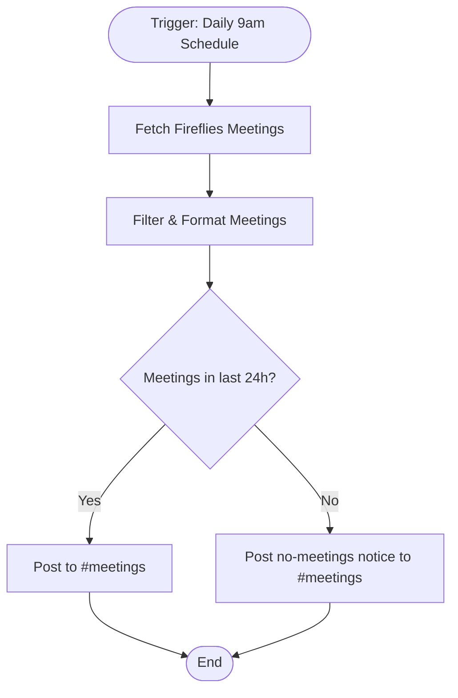

# context.md — Meetings - Fireflies Summary - Slack

## Purpose
Eliminates the manual effort of summarising and sharing meeting recaps by automatically pulling yesterday's Fireflies.ai recordings each morning and posting a structured summary to Slack #meetings.

## What It Does
1. Fires every day at 9:00am via a schedule trigger
2. Calls the Fireflies.ai GraphQL API to fetch the 10 most recent transcripts, including AI summary, action items, and participant list
3. Filters results to only meetings that occurred in the past 24 hours
4. Formats each meeting into a structured Slack message: title, date, duration, AI summary, and action items
5. If no meetings were recorded in the past 24 hours, posts a friendly "no meetings" notice
6. Posts one Slack message per meeting to the #meetings channel

## Workflow Diagram

> Diagram derived from workflow node graph at submission time.

## Tools & Connectors Used
| Tool / Service | How It's Used |
|---|---|
| Fireflies.ai | Source of meeting transcripts, AI summaries, and action items via GraphQL API |
| Slack | Destination — posts formatted recap messages to #meetings |

## Credentials Required
| Credential Name | Service | Notes |
|---|---|---|
| Fireflies API Key | Fireflies.ai | HTTP Header Auth — Bearer token. Get from app.fireflies.ai → Integrations → API |
| Slack OAuth2 | Slack | Standard OAuth2 — requires chat:write and channels:read scopes |

> ⚠️ Never include credential values — names only.

## KPI Baseline
| Metric | Value |
|---|---|
| Manual time per run (before) | 5 minutes |
| Estimated runs per week | 5 |
| Projected hours saved/week | 0.42 hours |

## Risk Self-Assessment
| Risk Type | Present? | Notes |
|---|---|---|
| Handles PII / personal data | Yes | Meeting titles and participant names from Fireflies may contain PII |
| Makes external API calls | Yes | Fireflies.ai GraphQL API and Slack API |
| Involves financial data | No | — |
| Requires human decision point | No | Fully automated |

## Submitter
**Name:** Gaurav Shakya
**Email:** gaurav.shakya@fulcrumapp.com
**Date:** 2026-05-29
**n8n Workflow ID:** K1bY275O7AyoJiAF
**Registry ID:** 10eceeaf-ac40-44e7-86d2-77c926202b81
**Instance:** fulcrumtest.app.n8n.cloud
