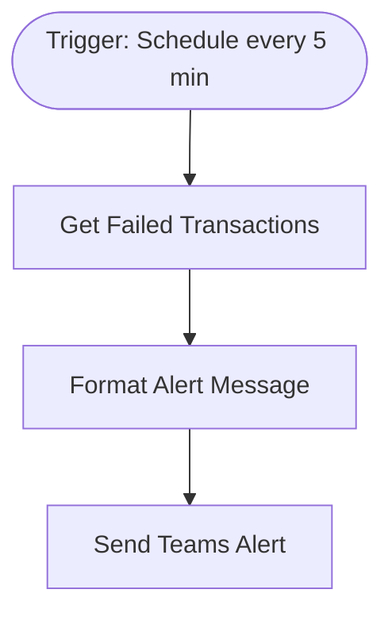

# context.md — Monitoring - Alert Failed Transactions - Microsoft Teams

## Purpose
Eliminates manual monitoring of the transactions database by automatically detecting failed transactions every 5 minutes and routing alerts directly to the ops team's Microsoft Teams channel.

## What It Does
1. A schedule trigger fires every 5 minutes
2. The Postgres node runs a SELECT query against the `transactions` table for any rows with `status = 'failed'` in the last 5 minutes, ordered by most recent first
3. If one or more failed transactions are found, the Set node formats an HTML alert card per row, extracting `transaction_id`, `account_id`, `amount`, `currency`, `error_code`, `error_message`, and `created_at`
4. The Microsoft Teams node posts one formatted HTML message to the configured channel for each failed transaction
5. If no failed transactions are found in a given poll, the workflow silently no-ops — no spurious alerts

## Workflow Diagram

> Diagram derived from workflow node graph at submission time.

## Tools & Connectors Used
| Tool / Service | How It's Used |
|---|---|
| PostgreSQL | Source — queries `transactions` table for `status = 'failed'` rows in last 5 min |
| Microsoft Teams | Destination — posts one HTML alert card per failed transaction to a channel |

## Credentials Required
| Credential Name | Service | Notes |
|---|---|---|
| PostgreSQL - Production DB | PostgreSQL | Read-only access; SELECT on `transactions` table |
| Microsoft Teams OAuth2 | Microsoft Teams | Requires `ChannelMessage.Send` scope; `teamId` and `channelId` must be configured in the node |
> ⚠️ Never include credential values — names only.

## KPI Baseline
| Metric | Value |
|---|---|
| Manual time per run (before) | 15 minutes |
| Estimated runs per week | 12 |
| Projected hours saved/week | 3.0 hours |

## Risk Self-Assessment
| Risk Type | Present? | Notes |
|---|---|---|
| Handles PII / personal data | Possible | `account_id` and transaction amounts may constitute PII depending on data classification policy |
| Makes external API calls | Yes | Microsoft Teams Graph API |
| Involves financial data | Yes | Transaction amounts and error codes are financial in nature |
| Requires human decision point | No | Fully automated alerting; humans act on alerts independently |

## Submitter
**Name:** Vishal Mishra
**Email:** vishalm.mishra@fulcrumapp.com
**Date:** 2026-05-29
**n8n Workflow ID:** AYp70kHaSYW80jus
**Registry ID:** 05ae8698-435b-442d-8eb4-530e256a463a
**Instance:** fulcrumtest.app.n8n.cloud
