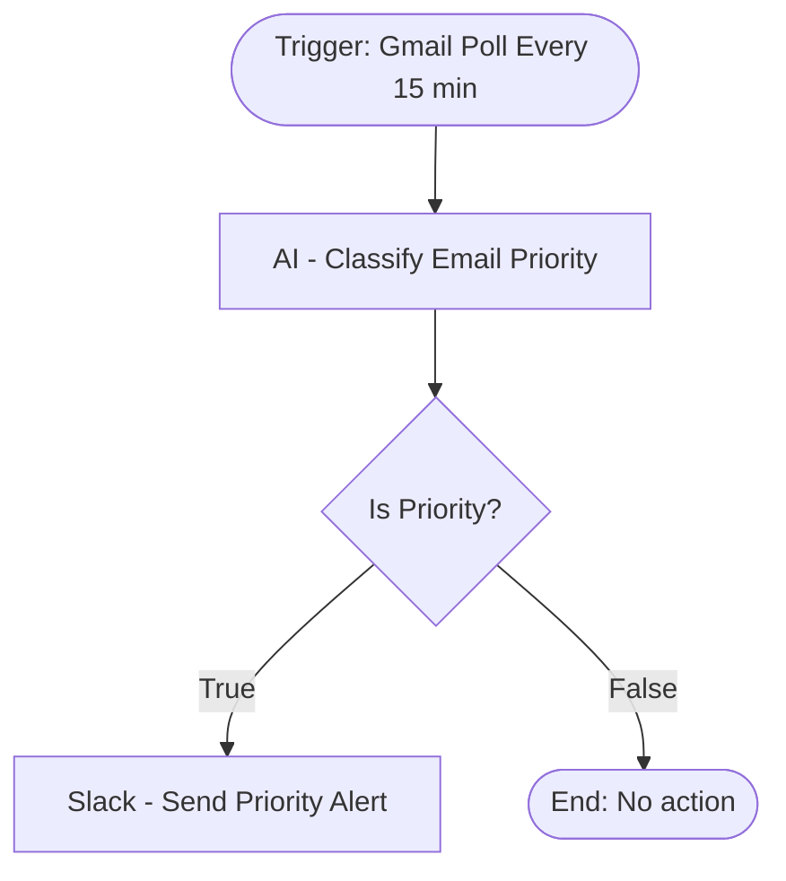

# context.md — Notifications - Email Triage - Slack

## Purpose
Reduces email overload by automatically identifying unread emails that are urgent, high-priority, or contain action items, and delivering an instant Slack alert so the recipient never misses something important.

## What It Does
1. Gmail Trigger polls for new unread emails every 15 minutes
2. Each unread email is passed to an AI Agent (GPT-4o-mini) which reads the full subject and body
3. The AI classifies the email: is it priority? what type? what's the summary? what are the action items?
4. An IF node checks whether `is_priority` is true
5. If yes, a formatted Slack message is sent to the `#email-alerts` channel with the sender, subject, priority type, one-line summary, and bulleted action items
6. Non-priority emails are silently dropped — no noise for routine messages

## Workflow Diagram

> Diagram auto-generated from workflow node graph at submission time.
> Each box represents an n8n node in execution order.
> Diamond shapes represent conditional / IF branches.
> Rounded boxes mark the trigger and terminal nodes.

## Tools & Connectors Used
| Tool / Service | How It's Used |
|---|---|
| Gmail (Trigger) | Polls every 15 minutes for new unread emails; fetches full body for AI analysis |
| OpenAI GPT-4o-mini | Classifies each email — priority type, summary, action items — via structured output |
| Structured Output Parser | Enforces JSON schema for AI response: `is_priority`, `priority_type`, `summary`, `action_items` |
| Slack | Posts a formatted alert to `#email-alerts` channel for every priority email |

## Credentials Required
| Credential Name | Service | Notes |
|---|---|---|
| Gmail OAuth2 | Gmail | Must have read access to the inbox |
| OpenAI API Key | OpenAI | Standard API key with GPT-4o-mini access |
| Slack OAuth2 | Slack | Must have `chat:write` scope; `#email-alerts` channel must exist |

> ⚠️ Never include credential values — names only.

## KPI Baseline
| Metric | Value |
|---|---|
| Manual email-checking time per day | ~20 minutes |
| Estimated priority emails per day | ~10–15 |
| Projected time saved per month | ~8–10 hours |

## Risk Self-Assessment
| Risk Type | Present? | Notes |
|---|---|---|
| Handles PII / personal data | Yes | Email content (names, addresses in email body) is passed to OpenAI API |
| Makes external API calls | Yes | Gmail API, OpenAI API, Slack API |
| Involves financial data | Possible | Depends on email content — workflow does not store any data |
| Requires human decision point | No | Fully automated; humans act on Slack alerts at their discretion |

## Submitter
**Name:** Vishal Mishra  
**Date:** 2026-05-22  
**n8n Workflow ID:** 5nzkXmigoTODmeb1  
**Instance:** fulcrumtest.app.n8n.cloud
