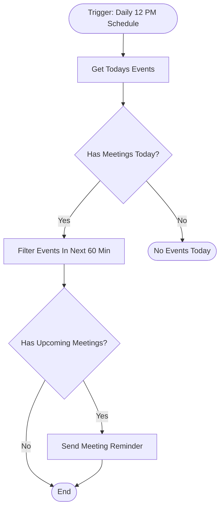

# context.md — Notifications - Meeting Reminder - Slack

## Purpose
Eliminates missed meetings by automatically checking Google Calendar every weekday at 12 PM and sending a Slack DM reminder ~15 minutes before any upcoming meeting.

## What It Does
1. Triggers daily at 12:00 PM on a schedule
2. Fetches all events from the user's primary Google Calendar for the rest of the day
3. Checks if any events exist — if none, the workflow exits silently
4. Filters events to those starting in the next 13–60 minutes (to catch the 15-min window accounting for scheduler drift)
5. Checks if any filtered upcoming events remain
6. Sends a Slack DM to the user for each qualifying meeting with the meeting name, start time, and a join link

## Workflow Diagram

> Diagram auto-generated from workflow node graph at submission time.

## Tools & Connectors Used
| Tool / Service | How It's Used |
|---|---|
| Google Calendar | Reads all events from the user's primary calendar for the rest of the day |
| Slack | Sends a DM reminder to the workflow owner before each upcoming meeting |

## Credentials Required
| Credential Name | Service | Notes |
|---|---|---|
| Google Calendar OAuth2 | Google Calendar | Read-only access to primary calendar |
| Slack OAuth2 | Slack | Write access to send DMs (chat:write scope) |
> ⚠️ Never include credential values — names only.

## KPI Baseline
| Metric | Value |
|---|---|
| Manual time per run (before) | 10 minutes |
| Estimated runs per week | 5 |
| Projected hours saved/week | 0.83 hours |

## Risk Self-Assessment
| Risk Type | Present? | Notes |
|---|---|---|
| Handles PII / personal data | Yes | Reads calendar event titles and attendee links — no data is stored or forwarded |
| Makes external API calls | Yes | Google Calendar API (read), Slack API (write) |
| Involves financial data | No | — |
| Requires human decision point | No | Fully automated reminder flow |

## Submitter
**Name:** Vishal Mishra
**Email:** vishalm.mishra@fulcrumapp.com
**Date:** 2026-05-29
**n8n Workflow ID:** aLD2HKMTLgRQWM7U
**Registry ID:** d82bcaf0-f9d4-469d-9d17-ef6fe603c548
**Instance:** fulcrumtest.app.n8n.cloud
