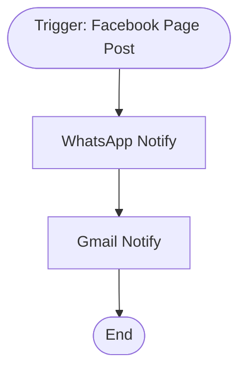

# context.md — Social - Monitor Facebook Posts - WhatsApp & Gmail

## Purpose
Automatically notifies the Marketing team via WhatsApp and Gmail whenever a new post is published on the company's Facebook Page, eliminating the need to manually monitor Facebook for updates.

## What It Does
1. The Facebook Page Post Trigger listens for new feed activity on the configured Facebook Page
2. When a new post is detected, it sends a WhatsApp text message to the configured recipient with the post content, timestamp, and a direct link
3. It then sends a formatted HTML email via Gmail summarising the same post details (type, message, time, post ID, and Facebook link)

## Workflow Diagram

> Diagram auto-generated from workflow node graph at submission time.

## Tools & Connectors Used
| Tool / Service | How It's Used |
|---|---|
| Facebook (Page Trigger) | Listens for new feed posts on the configured Facebook Page |
| WhatsApp Business Cloud | Sends a text message notification to the configured recipient phone number |
| Gmail | Sends an HTML email summary of the new post to the configured recipient address |

## Credentials Required
| Credential Name | Service | Notes |
|---|---|---|
| Facebook Graph App | Facebook | Must have `pages_read_engagement` and webhook subscription permissions |
| WhatsApp Business Cloud API | WhatsApp Business Cloud | Must have a verified sender phone number ID configured in Meta Business Suite |
| Gmail OAuth2 | Gmail | OAuth2 with `gmail.send` scope |

> ⚠️ Never include credential values — names only.

## KPI Baseline
| Metric | Value |
|---|---|
| Manual time per run (before) | 5 minutes |
| Estimated runs per week | 5 |
| Projected hours saved/week | 0.42 hours |

## Risk Self-Assessment
| Risk Type | Present? | Notes |
|---|---|---|
| Handles PII / personal data | No | Only processes public Facebook Page post content |
| Makes external API calls | Yes | Facebook Graph API, WhatsApp Business Cloud API, Gmail API |
| Involves financial data | No | — |
| Requires human decision point | No | Fully automated notification pipeline |

## Submitter
**Name:** Vishal Mishra
**Email:** vishal.mishra@fulcrumapp.com
**Date:** 2026-05-29
**n8n Workflow ID:** Wt30C2kiaMCvXCqX
**Registry ID:** 982d2af0-70cc-436b-963b-f8a0385bceed
**Instance:** fulcrumtest.app.n8n.cloud
